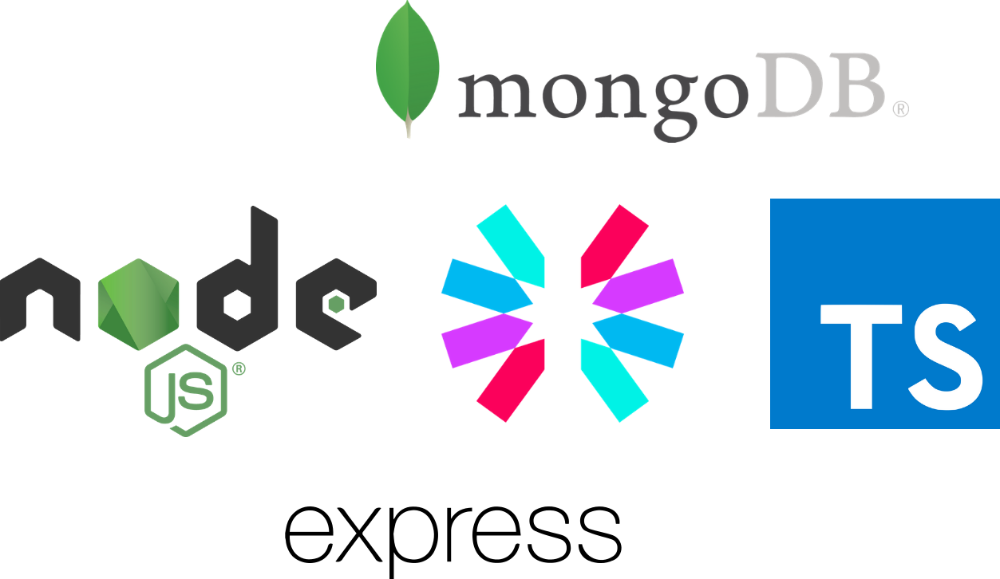

# TypeScrip API REST
Ejemplo de un API REST realizada con TypeScript

- [TypeScrip API REST](#typescrip-api-rest)
  - [Sobre el proyecto](#sobre-el-proyecto)
  - [Arquitectura y diseño](#arquitectura-y-diseño)
    - [JEST](#jest)
    - [EndPoints](#endpoints)
  - [Autor](#autor)
  - [Licencia](#licencia)

## Sobre el proyecto

El proyecto consiste en que tengas un ejemplo de API REST pero realizada con TypeScript con el objetivo de mejorar con tipos tus desarrollos.

## Arquitectura y diseño
El diseño de esta API REST se corresponde con el patron Servidor->Enrutador->Controlador->Modelo. 
El Servidor escucha en un puesto diversas peticiones. Las procesa según su ruta o punto de entrada y se las pasa al Enrutador.
El Enrutador analiza la petición dependiendo de la ruta y se la pasa al Controlador correspondiente a dicha ruta que ejecutará el método indicado.
El Controlador realiza el método indicado según la ruta consultando los modelos y almacenamiento para ello.
El Modelo es la estructuración de los datos a tratar.

En todo momento se ofrece información de la petición en base a los códigos de estado HTTP.

### JEST
Se ha usado la librería Jest, con TypeScript para realizar los test siguiendo un enfoque TDD y Supertest para testear las peticiones HTTP a la API.

### EndPoints
Los Endpoints para conectarse y consumir esta api rest, empiezan siempre por /api/vx/recurso, donde x es a versión de esta api, y recurso es el recurso a consumir, por ejemplo /api/v1/notas.

| Método | Recurso | Descripción |
| -- | -- | -- |
| GET| notas | Obtiene todas las notas |
| Contenido 2-1 | Contenido 2-2 | Contenido 2-3 |
| Contenido 3-1 | Contenido 3-2 | Contenido 3-3 |

## Autor

Codificado con :sparkling_heart: por [José Luis González Sánchez](https://twitter.com/joseluisgonsan)

## Licencia

Este proyecto esta licenciado bajo licencia **MIT**, si desea saber más, visite el fichero
[LICENSE](./LICENSE) para su uso docente y educativo.
